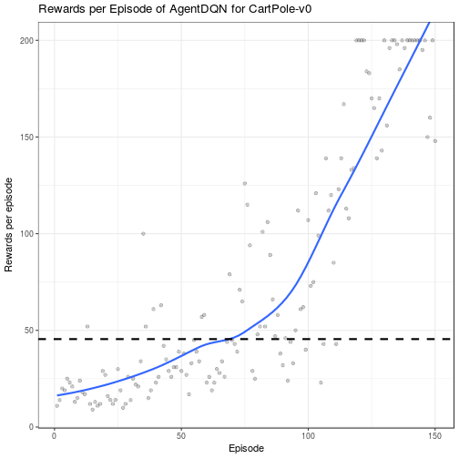

[](https://travis-ci.com/smilesun/rlR)
[](https://coveralls.io/github/smilesun/rlR?branch=master)
[](https://ci.appveyor.com/project/smilesun/rlr)

# rlR: Deep Reinforcement learning in R

## Installation

```r
devtools::install_github("smilesun/rlR")
```
or 


```r
devtools::install_github("smilesun/rlR", dependencies = TRUE)
```
To run the examples,  you need to have Python3 Package `tensorflow-1.8.0`, `keras-2.1.6`, `gym-0.10.5` installed in the **same** python package path. Other versions might also work but not tested.

If not, install the above three python packages or:

For Unix user
- Ensure that you have **either** of the following available
  - Python3 Virtual Environment: `{python eval=F}pip install virtualenv`
  - Anaconda
- Install dependencies through `{r eval=F} rlR::installDep2SysVirtualEnv(gpu = FALSE)` if you have python virtualenv available or `{r eval=FALSE} rlR::installDepConda(gpu = FALSE)` if you have anaconda available.


For Windows user
- Ensure that you have Anaconda available.
- Install dependencies through `{r eval=FALSE} rlR::installDepConda(gpu = FALSE)` 

## Usage

```r
library(rlR)
listGymEnvs()[1L:10L]
```

```
## The following gym envs are simply listed without being tested
```

```
##                    Copy-v0              RepeatCopy-v0 
##                  "Copy-v0"            "RepeatCopy-v0" 
##        ReversedAddition-v0       ReversedAddition3-v0 
##      "ReversedAddition-v0"     "ReversedAddition3-v0" 
##         DuplicatedInput-v0                 Reverse-v0 
##       "DuplicatedInput-v0"               "Reverse-v0" 
##                CartPole-v0                CartPole-v1 
##              "CartPole-v0"              "CartPole-v1" 
##             MountainCar-v0   MountainCarContinuous-v0 
##           "MountainCar-v0" "MountainCarContinuous-v0"
```

```r
env = makeGymEnv("CartPole-v1")
env$overview()
```

```
## 
## action cnt: 2 
## state dim: 4 
## discrete action
```

```r
listAvailAgent(env)
```

```
## $AgentDQN
## [1] "Deep Q learning"
## 
## $AgentFDQN
## [1] "Frozen Target Deep Q Learning"
## 
## $AgentDDQN
## [1] "Double Deep QLearning"
## 
## $AgentPG
## [1] "Policy Gradient Monte Carlo"
## 
## $AgentPGBaseline
## [1] "Policy Gradient with Baseline"
## 
## $AgentActorCritic
## [1] "Actor Critic Method"
```


```r
conf = getDefaultConf("AgentDQN")
conf$show()
```

```
##                                    value
## render                             FALSE
## log                                FALSE
## console                            FALSE
## agent.gamma                         0.99
## agent.flag.reset.net                TRUE
## agent.lr.decay         0.999000499833375
## agent.lr                           0.001
## agent.store.model                  FALSE
## policy.maxEpsilon                      1
## policy.minEpsilon                   0.01
## policy.decay           0.999000499833375
## policy.softmax.magnify                 1
## replay.batchsize                      64
## replay.memname                   Uniform
## replay.mem.size                    20000
## replay.epochs                          1
## replay.freq                            1
## policy.name                  ProbEpsilon
```

```r
conf$set(render = FALSE, console = FALSE)
```


```r
agent = makeAgent("AgentDQN", env, conf)
perf = agent$learn(150L)
```


```r
perf$plot()
```


