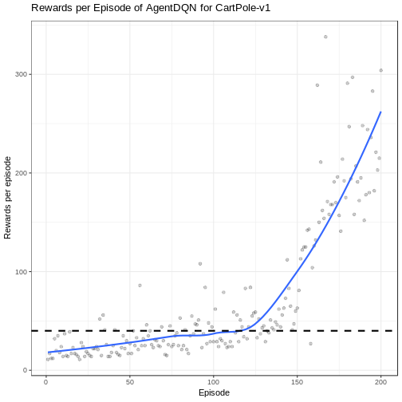

[](https://travis-ci.com/smilesun/rlR)
[](https://coveralls.io/github/smilesun/rlR?branch=master)
[](https://ci.appveyor.com/project/smilesun/rlr)

# rlR: Deep Reinforcement learning in R

## Installation

### R package installation

```r
devtools::install_github("smilesun/rlR")
```
or 


```r
devtools::install_github("smilesun/rlR", dependencies = TRUE)
```

### Configure to connect to python
To run the examples,  you need to have the python packages `numpy-1.14.5`, `tensorflow-1.8.0`, `keras-2.1.6`, `gym-0.10.5` installed in the **same** python path. 

This python path can be your system default python path or a virtual environment(either system python virtual environment or anaconda virtual environment).

Other package versions might also work but not tested.

To look at all python paths you have, in a R session, run

```r
reticulate::py_discover_config()
```

Check which is your system default python:

```r
Sys.which("python")
```

If you want to use a python path other than this system default, run the following before doing anything else.

```r
reticulate::use_python("/usr/bin/python", required=TRUE)
```
**"Note that you can only load one Python interpreter per R session so the use_python call only applies before you actually initialize the interpreter."** Which means if you changed your mind, you have to close the current R session and open a new R session.

Confirm from the following if the first path is the one you wanted

```r
reticulate::py_config()
```

### Python dependencies installation by rlR function
It is not recommended to mix things up with the system python, so by default, the rlR facility will install the dependencies to virtual environment named 'r-tensorflow' either to your system virtualenv or Anaconda virtualenv.

For Unix user
- Ensure that you have **either** of the following available
  - Python3 Virtual Environment: `{python eval=F}pip install virtualenv`
  - Anaconda
- Install dependencies through `{r eval=F} rlR::installDep2SysVirtualEnv(gpu = FALSE)` if you have python virtualenv available or `{r eval=FALSE} rlR::installDepConda(gpu = FALSE)` if you have anaconda available.


For Windows user
- Ensure that you have Anaconda available.
- Install dependencies through `{r eval=FALSE} rlR::installDepConda(gpu = FALSE)` 

If you want to have gpu support, simply set the gpu argument to be true in the function call.

### Mannual python dependency installation
You can also install python dependencies without using rlR facility function, for example, you can open an anaconda virtual environment  'r-tensorflow' by
`{bash eval=F} source activate r-tensorflow`
`{python eval=F}pip install gym`
`{python eval=F}pip install gym[atari]`

## Usage

```r
library(rlR)
listGymEnvs()[1L:10L]
```

```
##  [1] "CartPole-v0"              "CartPole-v1"             
##  [3] "MountainCar-v0"           "MountainCarContinuous-v0"
##  [5] "Pendulum-v0"              "Acrobot-v1"              
##  [7] "LunarLander-v2"           "LunarLanderContinuous-v2"
##  [9] "BipedalWalker-v2"         "BipedalWalkerHardcore-v2"
```

```r
env = makeGymEnv("CartPole-v1")
env$overview()
```

```
## 
## action cnt: 2 
## state original dim: 4 
## discrete action
```

```r
listAvailAgent(env)
```

```
## $AgentDQN
## [1] "Deep Q learning"
## 
## $AgentFDQN
## [1] "Frozen Target Deep Q Learning"
## 
## $AgentDDQN
## [1] "Double Deep QLearning"
## 
## $AgentPG
## [1] "Policy Gradient Monte Carlo"
## 
## $AgentPGBaseline
## [1] "Policy Gradient with Baseline"
## 
## $AgentActorCritic
## [1] "Actor Critic Method"
```


```r
conf = getDefaultConf("AgentDQN")
conf$show()
```

```
##                                      value
## render                               FALSE
## log                                  FALSE
## console                              FALSE
## agent.gamma                           0.99
## agent.flag.reset.net                  TRUE
## agent.lr.decay           0.999000499833375
## agent.lr                             0.001
## agent.store.model                    FALSE
## agent.update.target.freq               200
## agent.start.learn                       64
## agent.clip.td                        FALSE
## policy.maxEpsilon                        1
## policy.minEpsilon                     0.01
## policy.decay.rate        0.999000499833375
## policy.decay.type                decay_geo
## policy.aneal.steps                   1e+06
## policy.softmax.magnify                   1
## replay.batchsize                        64
## replay.memname                     Uniform
## replay.mem.size                      20000
## replay.epochs                            1
## replay.freq                              1
## policy.name                    ProbEpsilon
```

```r
conf$set(render = FALSE, console = FALSE)   # Since this file is generated by Rmarkdown, we do not want other output message to blur the markdown file.
```


```r
agent = makeAgent("AgentDQN", env, conf)
ptmi = proc.time()
perf = agent$learn(200L)
proc.time() - ptmi
```

```
##     user   system  elapsed 
## 1123.364   18.988 1089.296
```


```r
agent$plotPerf()
```


